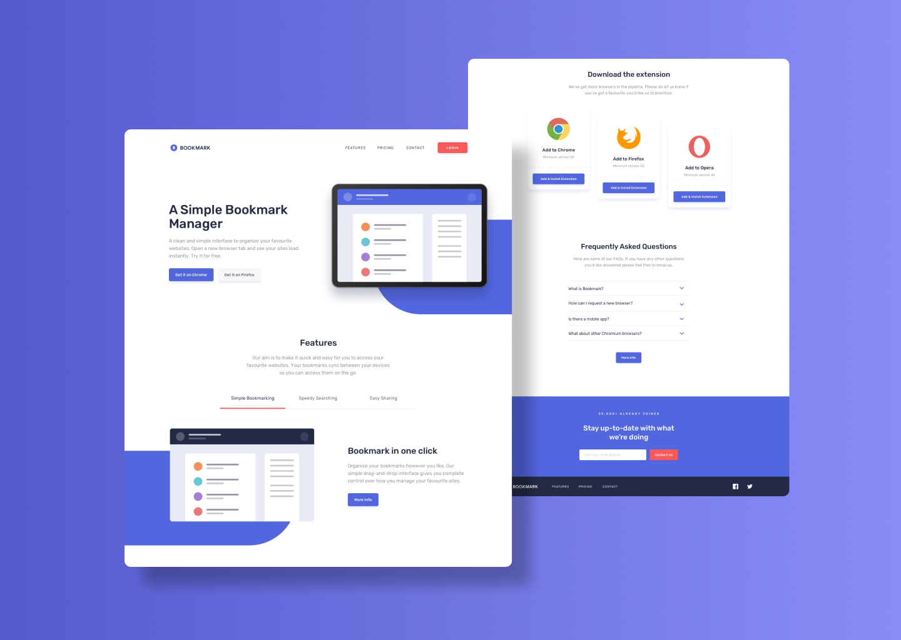

# Bookmark &mdash; LandingPage ✅



Bookmark is a landing page developed to apply my frontend skills. This design was made by FrontEndMentor but all the development process was made by me. 

In addition to this, it is completely responsive. It has a slider, an interactive menu and animated sections. 

If you want to check it out, you can find this project in:

```
https://bookmarksrsn.netlify.app/
```

## Technologies

Different techonologies were used to developed this web page. However, the most important ones are:

  * HTML5
  * CSS3 ( Flexbox and Grid )
  * Javascript


## UI Considerations
Colors:

  * Primary: #5368df
  * Primary-2: #252b46
  * Secondary: #fa5757
  * Gray: #9194a1

Breaking Points:

This projects uses "desktop first" principle to make it 100% resposive.

  * Phone: 576px
  * Tablet: 768px
  * Phone: 990px